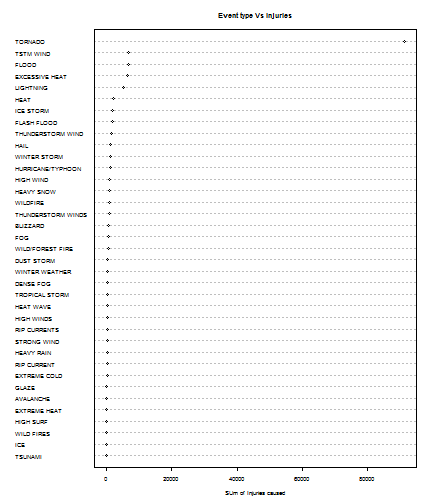
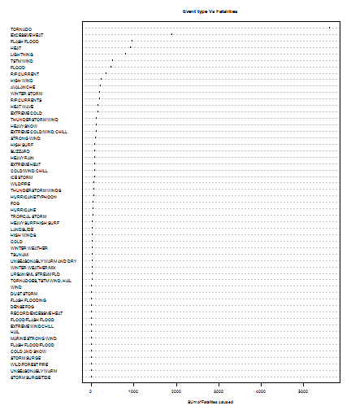

 U.S. National Oceanic and Atmospheric Administration's (NOAA) Analysis 
========================================================

### Reproducible Research: Peer Assessment 1

## Synopsis
Here is going to be cleaned and processed a data base from  U.S. National Oceanic and Atmospheric Administration's (NOAA) ,  the goal is to gain insight about natural  events that occurred from 1950 to 2011, discover which ones cases more injuries and deaths and which ones causes more costs . 

## Data Processing
Load Data  and set working directory. 


```r
Data <- read.csv(bzfile("C:/Users/JosePortatil/Documents/GitHub/RepData_PerrAss2/repdata-data-StormData.csv.bz2"))
setwd("C:/Users/JosePortatil/Documents/GitHub/RepData_PerrAss2/")
```


Load library required 


```r
require(car)
```

```
## Loading required package: car
```

```
## Warning: package 'car' was built under R version 3.0.3
```


Here the major events are going to ve grouped in some categories because there are too much events an its better have bigger groups with more generics names : 


```r
Data$EVTYPE<-with(Data,recode(EVTYPE,"  
                        c('avalanche', 'avalance', 'blizzard', 'chill', 'cold', 'cool', 'glaze', 'hypothermia', 'hyperthermia', 
'ice', 'icy', 'freez', 'frost', 'low temp', 'sleet', 'snow', 'wint')='COLD / ICE';
                        c('below normal precip', 'dry', 'drie', 'drought', 'fire', 'heat', 'high temp', 'hot', 'warm')
='HEAT / DROUGHT / FIRE';
                        c('fog', 'vog')='FOG';
                         c('coast', 'cstl', 'current', 'dam fail', 'dam break', 'drizzle', 'drown', 'erosion', 'erosin', 
'flood', 'floood', 'fld', 'heavy shower', 'high water', 'high waves', 'lake', 'landslump', 'marine', 'precip', 'rain', 
'rising water', 'river', 'rogue wave', 'slide', 'stream', 'sea', 'seiche', 'surf', 'swell', 'tide', 'tidal', 'torrent', 'wet')='RAIN / FLOOD / HIGH SEAS';
                      c('burst', 'cloud', 'depression', 'floyd', 'funnel', 'gust', 'hail', 'hurricane', 'landspout', 
'storm', 'southeast', 'thunderstorm', 'thundertsorm', 'thundestorm', 'tornado', 'torndao', 'tstm', 'turbulence', 'typhoon', 
'wall', 'waterspout', 'water spout', 'wayterspout', 'wind', 'wnd')
='WIND / STORM / TORNADO';
c('lightning', 'ligntning', 'lighting')='LIGHTNING';
c('tsunami', 'volcan')='VOLCANIC ERUPTION / EARTHQUAKE / TSUNAMI';
                        c('dust')='DUST'"))
```


Group by Event type (EVTYPE) and sum injuries in each category. 

```r
library(plyr)
```

```
## Warning: package 'plyr' was built under R version 3.0.2
```

```r
INJURIESSummary <- ddply(Data, ~EVTYPE, summarise, sum_INJURIES = sum(INJURIES, 
    na.rm = TRUE))
```


Extract events with injuries higher than 100 

```r
EventsInjuries <- subset(INJURIESSummary, sum_INJURIES > 100)
```


Order Events by INJURIES

```r
EventsInjuries <- EventsInjuries[order(EventsInjuries$sum_INJURIES), ]
EventsInjuries
```

```
##                 EVTYPE sum_INJURIES
## 877            TSUNAMI          129
## 417                ICE          137
## 954         WILD FIRES          150
## 350          HIGH SURF          152
## 142       EXTREME HEAT          155
## 19           AVALANCHE          170
## 222              GLAZE          216
## 140       EXTREME COLD          231
## 585        RIP CURRENT          232
## 290         HEAVY RAIN          251
## 676        STRONG WIND          280
## 586       RIP CURRENTS          297
## 376         HIGH WINDS          302
## 278          HEAT WAVE          309
## 848     TROPICAL STORM          340
## 89           DENSE FOG          342
## 978     WINTER WEATHER          398
## 117         DUST STORM          440
## 955   WILD/FOREST FIRE          545
## 188                FOG          734
## 30            BLIZZARD          805
## 786 THUNDERSTORM WINDS          908
## 957           WILDFIRE          911
## 310         HEAVY SNOW         1021
## 359          HIGH WIND         1137
## 411  HURRICANE/TYPHOON         1275
## 972       WINTER STORM         1321
## 244               HAIL         1361
## 760  THUNDERSTORM WIND         1488
## 153        FLASH FLOOD         1777
## 427          ICE STORM         1975
## 275               HEAT         2100
## 464          LIGHTNING         5230
## 130     EXCESSIVE HEAT         6525
## 170              FLOOD         6789
## 856          TSTM WIND         6957
## 834            TORNADO        91346
```


Group by Event type (EVTYPE) and sum Fatalities in each category.


```r
FATALITIESSummary <- ddply(Data, ~EVTYPE, summarise, sum_FATALITIES = sum(FATALITIES, 
    na.rm = TRUE))
```


Extract events with fatalities higher than 10

```r
EventsFATALITIES <- subset(FATALITIESSummary, sum_FATALITIES > 10)
```


Order 

```r
EventsFATALITIES <- EventsFATALITIES[order(EventsFATALITIES$sum_FATALITIES), 
    ]
EventsFATALITIES
```

```
##                         EVTYPE sum_FATALITIES
## 671           STORM SURGE/TIDE             11
## 886          UNSEASONABLY WARM             11
## 955           WILD/FOREST FIRE             12
## 670                STORM SURGE             13
## 72               COLD AND SNOW             14
## 161          FLASH FLOOD/FLOOD             14
## 488         MARINE STRONG WIND             14
## 244                       HAIL             15
## 146          EXTREME WINDCHILL             17
## 177          FLOOD/FLASH FLOOD             17
## 580      RECORD/EXCESSIVE HEAT             17
## 89                   DENSE FOG             18
## 164             FLASH FLOODING             19
## 117                 DUST STORM             22
## 960                       WIND             23
## 842 TORNADOES, TSTM WIND, HAIL             25
## 919       URBAN/SML STREAM FLD             28
## 980         WINTER WEATHER/MIX             28
## 888  UNSEASONABLY WARM AND DRY             29
## 877                    TSUNAMI             33
## 978             WINTER WEATHER             33
## 66                        COLD             35
## 376                 HIGH WINDS             35
## 442                  LANDSLIDE             38
## 342       HEAVY SURF/HIGH SURF             42
## 848             TROPICAL STORM             58
## 402                  HURRICANE             61
## 188                        FOG             62
## 411          HURRICANE/TYPHOON             64
## 786         THUNDERSTORM WINDS             64
## 957                   WILDFIRE             75
## 427                  ICE STORM             89
## 79             COLD/WIND CHILL             95
## 142               EXTREME HEAT             96
## 290                 HEAVY RAIN             98
## 30                    BLIZZARD            101
## 350                  HIGH SURF            101
## 676                STRONG WIND            103
## 141    EXTREME COLD/WIND CHILL            125
## 310                 HEAVY SNOW            127
## 760          THUNDERSTORM WIND            133
## 140               EXTREME COLD            160
## 278                  HEAT WAVE            172
## 586               RIP CURRENTS            204
## 972               WINTER STORM            206
## 19                   AVALANCHE            224
## 359                  HIGH WIND            248
## 585                RIP CURRENT            368
## 170                      FLOOD            470
## 856                  TSTM WIND            504
## 464                  LIGHTNING            816
## 275                       HEAT            937
## 153                FLASH FLOOD            978
## 130             EXCESSIVE HEAT           1903
## 834                    TORNADO           5633
```


Susbet the ones with Billions B (Because the events in Billions of dollars are the ones with biggest costs), then apply GROUP BY , then plot points in billions. 


```r
EventsBillions <- subset(Data, PROPDMGEXP == "B")
CostSummary <- ddply(EventsBillions, ~EVTYPE, summarise, sum_COST = sum(PROPDMG, 
    na.rm = TRUE))
CostSummary
```

```
##                        EVTYPE sum_COST
## 1                 FLASH FLOOD     1.00
## 2                       FLOOD   122.50
## 3                        HAIL     1.80
## 4   HEAVY RAIN/SEVERE WEATHER     2.50
## 5                   HIGH WIND     1.30
## 6                   HURRICANE     5.70
## 7              HURRICANE OPAL     3.10
## 8   HURRICANE OPAL/HIGH WINDS     0.10
## 9           HURRICANE/TYPHOON    65.50
## 10                RIVER FLOOD     5.00
## 11        SEVERE THUNDERSTORM     1.20
## 12                STORM SURGE    42.56
## 13           STORM SURGE/TIDE     4.00
## 14                    TORNADO     5.30
## 15 TORNADOES, TSTM WIND, HAIL     1.60
## 16             TROPICAL STORM     5.15
## 17           WILD/FOREST FIRE     1.50
## 18                   WILDFIRE     1.04
## 19               WINTER STORM     5.00
```


Order By Cost 

```r
CostSummary <- CostSummary[order(CostSummary$sum_COST), ]
```


## Results

1. Across the United States, which types of events (as indicated in the EVTYPE variable) are most harmful with respect to population health?

Injuries: 

```r
# Simple Dotplot Injuries
dotchart(EventsInjuries$sum_INJURIES, labels = EventsInjuries$EVTYPE, cex = 0.5, 
    main = "Event type Vs Injuries", xlab = "SUm of Injuries caused")
```

 


Fatalities: 

```r
dotchart(EventsFATALITIES$sum_FATALITIES, labels = EventsFATALITIES$EVTYPE, 
    cex = 0.45, main = "Event type Vs Fatalities", xlab = "SUm of Fatalities caused")
```

 


 The Tordnado is the most Harmful with the highest Injuries and fatalities followed by excessive heat, flas flood  ... like is showed in this images. 
 
 
2. Across the United States, which types of events have the greatest economic consequences?


```r
dotchart(CostSummary$sum_COST, labels = CostSummary$EVTYPE, cex = 0.5, main = "Event type Vs Cost [Billions]", 
    xlab = "Cost in Billions ")
```

 


Flood is by far the event woth Greatest economic consequences in Billions of dollars, followed by hurricane and storm surge. 
